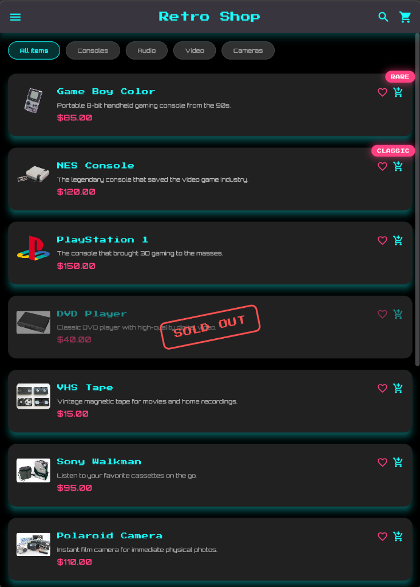
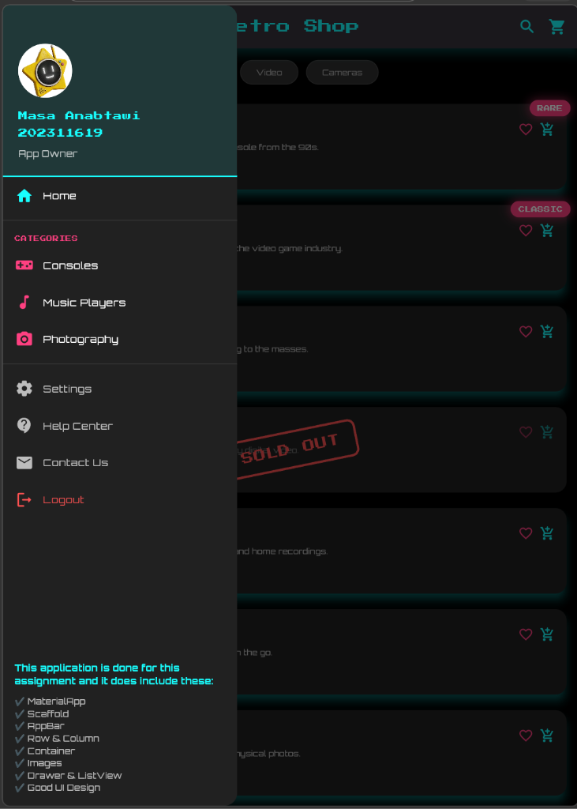

# 🕹️ Retro Shop - Assignment 1

A premium, neon-themed Flutter application showcasing a collection of vintage tech and retro collectibles. This project was built for a Flutter/Dart assignment, focusing on aesthetic UI design, static components, and a "vintage futurism" vibe. The application is built primarily using StatelessWidget, emphasizing simple structure, clean UI layout, and beginner-friendly Flutter development principles.

## 📸 Screenshots

  
  

## 🛠️ Technology Stack

*   **Framework:** Flutter (Channel stable)
*   **Language:** Dart
*   **Fonts:** Google Fonts (Orbitron, Press Start 2P)
*   **Icons:** Material Rounded Icons

## 📂 Project Structure

The project follows a clean MVC-like structure for organization:
- `lib/view/`: Main pages and UI lists.
- `lib/components/`: Reusable widgets (CustomItem, CustomDrawer).
- `lib/utils/`: Data files for titles, descriptions, images, and prices.
- `assets/images/`: Local repository for all product and profile photos.

---
**Created by Masa Anabtawi for the Flutter-Dart Course.**
